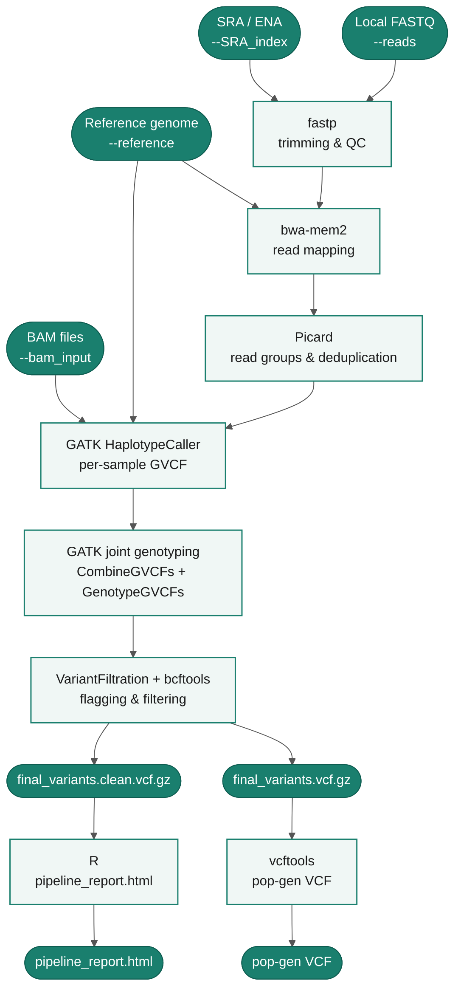

# Welcome to the documentation for genomepanel_nf

{ .gp-logo }

**genomepanel_nf** is a [Nextflow](https://www.nextflow.io/) pipeline for reference genome mapping, variant (SNP) calling and quality control on large genome panels. It accepts Illumina paired-end reads from local files, NCBI/ENA SRA accessions, or pre-processed BAM files, and produces fully genotyped and filtered VCF files along with a rich HTML quality-control report.

The pipeline is designed to run on HPC clusters via SLURM or on a single local machine, and uses [Singularity](https://sylabs.io/singularity/) containers so all software dependencies are reproducible and portable.

[Get started :octicons-rocket-16:](getting-started.md){ .md-button .md-button--primary }
[View on GitHub :octicons-mark-github-16:](https://github.com/crolllab/genomepanel_nf){ .md-button }

---

## Pipeline Summary

The pipeline accepts three input modes that converge at the variant calling step:

1. **Local FASTQ files** (`--reads`): raw paired-end Illumina reads are trimmed with fastp, mapped with bwa-mem2, sorted with samtools, assigned read groups and deduplicated with Picard.
2. **SRA/ENA accessions** (`--SRA_index`): accessions are resolved to run IDs and download URLs; paired-end and single-end runs are handled automatically before joining the same read-processing path.
3. **Pre-processed BAM files** (`--bam_input`): coordinate-sorted, read-group annotated BAMs skip directly to variant calling.

After read processing the pipeline performs **joint genotyping** across all samples using GATK HaplotypeCaller (GVCF mode), CombineGVCFs and GenotypeGVCFs. Variant filtration follows GATK best practices. A population-genetics VCF (thinned, MAF-filtered) is generated with vcftools. All QC metrics are collected into a single `pipeline_report.html`.

---

## Key features

-   :material-dna: **Flexible input**

    --- 

    Local FASTQ, SRA/ENA accessions, or pre-processed BAM files — all in the same run.

-   :material-server: **HPC-ready**

    ---

    SLURM profile with optimised resource requests. Parallel variant calling across genome segments.

-   :material-package-variant-closed: **Fully containerised**

    ---

    All tools run inside Singularity images pulled from the Galaxy Project depot.

-   :material-chart-line: **Built-in QC report**

    ---

    A single `pipeline_report.html` with fastp, BWA-mem2 and VCF quality plots.

---

## Software used by genomepanel_nf

Please cite the underlying tools if you use them through this pipeline.

| Tool | Version | Role | Reference |
|------|---------|------|-----------|
| [fastp](https://github.com/OpenGene/fastp) | 1.3.1 | Adapter trimming, read QC | Chen et al. 2018, *Bioinformatics* [doi:10.1093/bioinformatics/bty560](https://doi.org/10.1093/bioinformatics/bty560) |
| [bwa-mem2](https://github.com/bwa-mem2/bwa-mem2) | 2.3 | Read mapping | Vasimuddin et al. 2019, *IPDPS* [doi:10.1109/IPDPS.2019.00041](https://doi.org/10.1109/IPDPS.2019.00041) |
| [SAMtools](https://www.htslib.org/) | 1.23.1 | BAM manipulation & sorting | Danecek et al. 2021, *GigaScience* [doi:10.1093/gigascience/giab008](https://doi.org/10.1093/gigascience/giab008) |
| [Picard](https://broadinstitute.github.io/picard/) | 3.4.0 | Read group assignment, duplicate removal | Broad Institute 2019 |
| [GATK](https://gatk.broadinstitute.org/) | 4.6.2.0 | Haplotype calling, genotyping, variant filtration | Van der Auwera & O'Connor 2020 |
| [BCFtools](https://www.htslib.org/) | 1.23.1 | VCF filtering and manipulation | Danecek et al. 2021, *GigaScience* [doi:10.1093/gigascience/giab008](https://doi.org/10.1093/gigascience/giab008) |
| [vcftools](https://vcftools.github.io/) | 0.1.17 | Population-genetics VCF processing | Danecek et al. 2011, *Bioinformatics* [doi:10.1093/bioinformatics/btr330](https://doi.org/10.1093/bioinformatics/btr330) |
| [sra-tools](https://github.com/ncbi/sra-tools) | 3.4.1 | NCBI SRA data download | NCBI |
| [entrez-direct](https://www.ncbi.nlm.nih.gov/books/NBK179288/) | 24.0 | NCBI SRA accession resolution | NCBI |
| [R / tidyverse](https://www.tidyverse.org/) | 1.2.1 | QC visualisation | R Core Team; Wickham et al. 2019, *JOSS* [doi:10.21105/joss.01686](https://doi.org/10.21105/joss.01686) |

---

## Release notes

### v1.0.4 *(April 2026)*

- Added GitHub Pages documentation site at [crolllab.github.io/genomepanel_nf](https://crolllab.github.io/genomepanel_nf/).

### v1.0.3 *(April 2026)*

- Updated all Singularity container images to the latest Galaxy depot releases: sra-tools 3.4.1, fastp 1.3.1, bwa-mem2 2.3, samtools 1.23.1, bcftools 1.23.1, gatk4-spark 4.6.2.0 build 1.
- Redesigned QC report (`pipeline_report.html`): unified fastp, BWA and variant quality sections into a single HTML report with inline PDF plots (font-independent, works in all containers and browsers).
- Optimised SLURM resource requests across all pipeline modules.
- Added `--bam_input` alternative entry point for pre-processed BAM files.
- Added `--min_contig_length` option to filter short reference contigs.
- Added `--bwa_index` option to supply pre-built BWA-mem2 index files.

---

## Questions and feature requests

Questions, bug reports and feature requests are welcome on the [GitHub Issues](https://github.com/crolllab/genomepanel_nf/issues) page.

!!! question "Questions? Feature requests? Just ask!"
    I'm glad to answer questions on the [GitHub Issues](https://github.com/crolllab/genomepanel_nf/issues) page for the project, as well as take suggestions for features or improvements!
